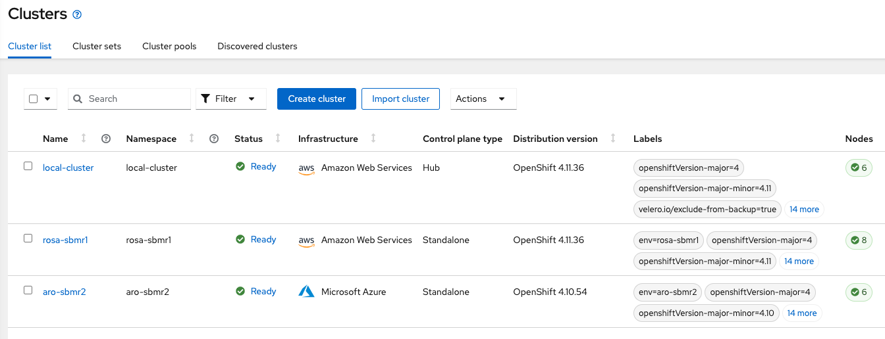
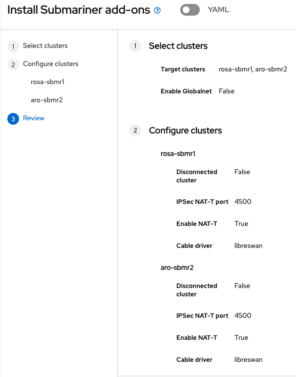
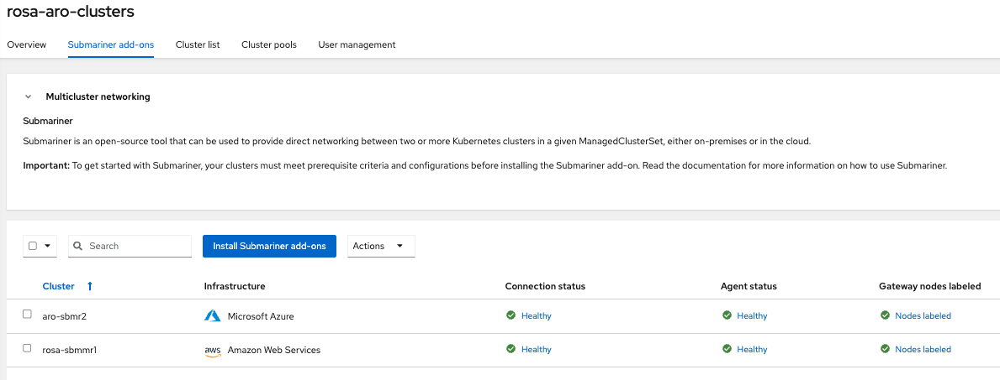
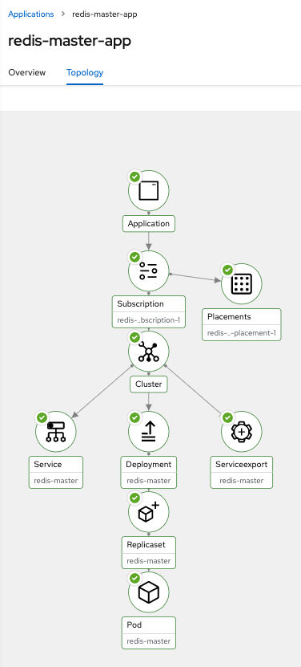
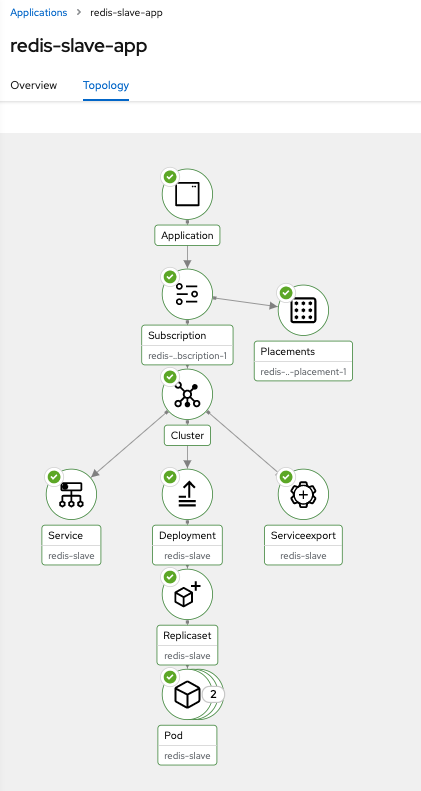
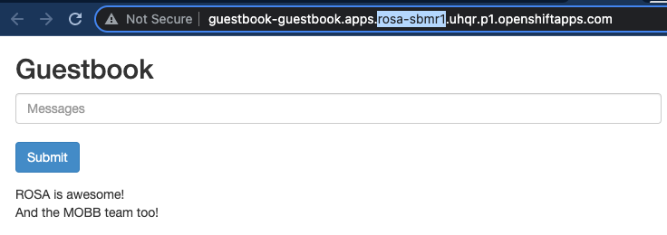

# Demo 1 - Connecting Multiclustering applications with RHACM and Submariner

Submariner is an open source tool that can be used with Red Hat Advanced Cluster Management for Kubernetes to provide direct networking between pods and compatible multicluster service discovery across two or more Kubernetes clusters in your environment, either on-premises or in the cloud.

This article describes how to deploy ACM Submariner for connecting overlay networks of ARO and ROSA clusters.

NOTE: Submariner for connecting ARO and ROSA clusters only works from ACM 2.7 onwards!

## 1. Prerequisites

* OpenShift Cluster version 4 (ROSA/ARO or non-ROSA/ARO)
* az cli
* rosa cli
* aws cli (optional)

## 2. Manage Multiple Logins

* In order to manage several clusters, we will add a new Kubeconfig file to manage the logins and change quickly from one context to another:

```
rm -rf /var/tmp/acm-lab-kubeconfig
touch /var/tmp/acm-lab-kubeconfig
export KUBECONFIG=/var/tmp/acm-lab-kubeconfig
```

## 3. Deploy ACM Cluster HUB

We will use the first OpenShift cluster to deploy ACM Hub. 

* Login into the HUB OpenShift cluster and set the proper context

```sh
oc login --username xxx --password xxx --server=https://api.cluster-xxx.xxx.xxx.xxx.com:6443

kubectl config rename-context $(oc config current-context) hub
kubectl config use hub
```

* Create the namespace for ACM

```sh
cat << EOF | kubectl apply -f -
apiVersion: v1
kind: Namespace
metadata:
  name: open-cluster-management
  labels:
    openshift.io/cluster-monitoring: "true"
EOF
```

* Create the OperatorGroup for ACM

```sh
cat << EOF | kubectl apply -f -
apiVersion: operators.coreos.com/v1
kind: OperatorGroup
metadata:
  name: open-cluster-management
  namespace: open-cluster-management
spec:
  targetNamespaces:
    - open-cluster-management
EOF
```

* Install Operator ACM 2.8

```sh
cat << EOF | kubectl apply -f -
apiVersion: operators.coreos.com/v1alpha1
kind: Subscription
metadata:
  name: advanced-cluster-management
  namespace: open-cluster-management
spec:
  channel: release-2.8
  installPlanApproval: Automatic
  name: advanced-cluster-management
  source: redhat-operators
  sourceNamespace: openshift-marketplace
EOF
```

NOTE: you can select from ACM 2.7 onwards for install ACM Submariner for ROSA/ARO. 

* Check that the Operator has installed successfully

```sh
kubectl get csv -n open-cluster-management
NAME                                 DISPLAY                                      VERSION   REPLACES                             PHASE
advanced-cluster-management.v2.8.2   Advanced Cluster Management for Kubernetes   2.7.2     advanced-cluster-management.v2.8.1   Succeeded
```

NOTE: ACM Submariner for ROSA clusters only works with ACM 2.7 or newer!

* Install MultiClusterHub instance in the ACM namespace

```sh
cat << EOF | kubectl apply -f -
kind: MultiClusterHub
apiVersion: operator.open-cluster-management.io/v1
metadata:
  name: multiclusterhub
  namespace: open-cluster-management
spec: {}
EOF
```

* Check that the `MultiClusterHub` is installed and running properly

```sh
kubectl get multiclusterhub -n open-cluster-management -o json | jq '.items[0].status.phase'
"Running"
```

NOTE: if it's not in Running state, wait a couple of minutes and check again.

## 4. Deploy ROSA Cluster

* Define the prerequisites for install the ROSA cluster

```sh
export ROSA_CLUSTER_NAME=rosa-summit-1 \
       AWS_ACCOUNT_ID=$(aws sts get-caller-identity --query Account --output text) \
       REGION=eu-west-1 \
       AWS_PAGER="" \
       CIDR="10.20.0.0/16" \
       POD_CIDR="10.132.0.0/14" \
       VERSION="4.13.13" \
       SERVICE_CIDR="172.31.0.0/16"
```

NOTE: it's critical that the Machine CIDR of the ROSA and ARO clusters not overlap, for that reason we're setting different CIDRs than the out of the box ROSA / ARO cluster install.  

* Create the IAM Account Roles

```sh
rosa create account-roles --mode auto --yes
```

* Generate a STS ROSA cluster

```sh
rosa create cluster -y --cluster-name ${ROSA_CLUSTER_NAME} \
 --region ${REGION} --version ${VERSION} \
 --machine-cidr $CIDR \
 --pod-cidr $POD_CIDR \
 --service-cidr $SERVICE_CIDR \
 --sts --mode auto
```

* Check the status of the Rosa cluster (40 mins wait until is in ready status)

```sh
rosa describe cluster --cluster ${ROSA_CLUSTER_NAME} | grep State
State:                      ready
```

* Set the admin user for the ROSA cluster

```sh
rosa create admin --cluster=$ROSA_CLUSTER_NAME
```

* Login into the rosa cluster and set the proper context

```sh
oc login https://api.rosa-sbmr1.xxx.xxx.xxx.com:6443 --username cluster-admin --password xxx

kubectl config rename-context $(oc config current-context) $ROSA_CLUSTER_NAME
kubectl config use $ROSA_CLUSTER_NAME

kubectl get dns cluster -o jsonpath='{.spec.baseDomain}'
```

## Generate ROSA New nodes for submariner 

* Create new node/s that will be used to run Submariner gateway using the following command (check https://github.com/submariner-io/submariner/issues/1896 for more details)

```sh
rosa create machinepool --cluster $ROSA_CLUSTER_NAME --name=sm-gw-mp --replicas=1 --labels='submariner.io/gateway=true'
```

NOTE: setting replicas=2 means that we allocate two nodes for SM GW , to support GW Active/Passive HA (check [Gateway Failover](https://submariner.io/getting-started/architecture/gateway-engine/) section ), if GW HA is not needed you can set replicas=1.

* Check the machinepools requested, including the submariner machinepool requested

```sh
rosa list machinepools -c $ROSA_CLUSTER_NAME
ID        AUTOSCALING  REPLICAS  INSTANCE TYPE  LABELS                        TAINTS    AVAILABILITY ZONES    SPOT INSTANCES
Default   No           2         m5.xlarge                                              eu-west-1a            N/A
sm-gw-mp  No           1         m5.xlarge      submariner.io/gateway=true              eu-west-1a            No
```

* After a couple of minutes, check the new nodes generated

```sh
kubectl get nodes --show-labels | grep submariner
```

## 5. Deploy ARO Cluster

> **IMPORTANT**: To enable Submariner in ROSA - ARO clusters, the POD_CIDR and SERVICE_CIDR can’t overlap between them. To avoid IP address conflicts, the ARO cluster needs to modify the default IP CIDRs. Check the Submariner docs for more information.

* Define the prerequisites for install the ARO cluster

```sh
AZR_RESOURCE_LOCATION=eastus
AZR_RESOURCE_GROUP=aro-sbmr2-rg
ARO_CLUSTER=aro-summit-1
AZR_PULL_SECRET=~/Downloads/pull-secret.txt
```

* Create an Azure resource group

```sh
 az group create \
   --name $AZR_RESOURCE_GROUP \
   --location $AZR_RESOURCE_LOCATION
```

* Create virtual network

```sh
 az network vnet create \
   --address-prefixes 10.0.0.0/22 \
   --name "$ARO_CLUSTER-aro-vnet-$AZR_RESOURCE_LOCATION" \
   --resource-group $AZR_RESOURCE_GROUP
```

* Create control plane subnet

```sh
 az network vnet subnet create \
   --resource-group $AZR_RESOURCE_GROUP \
   --vnet-name "$ARO_CLUSTER-aro-vnet-$AZR_RESOURCE_LOCATION" \
   --name "$ARO_CLUSTER-aro-control-subnet-$AZR_RESOURCE_LOCATION" \
   --address-prefixes 10.0.0.0/23 \
   --service-endpoints Microsoft.ContainerRegistry
```

* Create machine subnet

```sh
az network vnet subnet create \
  --resource-group $AZR_RESOURCE_GROUP \
  --vnet-name "$ARO_CLUSTER-aro-vnet-$AZR_RESOURCE_LOCATION" \
  --name "$ARO_CLUSTER-aro-machine-subnet-$AZR_RESOURCE_LOCATION" \
  --address-prefixes 10.0.2.0/23 \
  --service-endpoints Microsoft.ContainerRegistry
```

* Disable network policies on the control plane subnet

```bash
az network vnet subnet update \
  --name "$ARO_CLUSTER-aro-control-subnet-$AZR_RESOURCE_LOCATION" \
  --resource-group $AZR_RESOURCE_GROUP \
  --vnet-name "$ARO_CLUSTER-aro-vnet-$AZR_RESOURCE_LOCATION" \
  --disable-private-link-service-network-policies true
```

* Create the ARO cluster

```sh
 az aro create \
   --resource-group $AZR_RESOURCE_GROUP \
   --name $ARO_CLUSTER \
   --vnet "$ARO_CLUSTER-aro-vnet-$AZR_RESOURCE_LOCATION" \
   --master-subnet "$ARO_CLUSTER-aro-control-subnet-$AZR_RESOURCE_LOCATION" \
   --worker-subnet "$ARO_CLUSTER-aro-machine-subnet-$AZR_RESOURCE_LOCATION" \
   --pull-secret @$AZR_PULL_SECRET
```

* Get ARO OpenShift API Url

```sh
ARO_URL=$(az aro show -g $AZR_RESOURCE_GROUP -n $ARO_CLUSTER --query apiserverProfile.url -o tsv)
```

* Login into the ARO cluster and set context

```sh
ARO_KUBEPASS=$(az aro list-credentials --name $ARO_CLUSTER --resource-group $AZR_RESOURCE_GROUP -o tsv --query kubeadminPassword)
```

* Login into the ARO cluster and set context

```sh
oc login --username kubeadmin --password $ARO_KUBEPASS --server=$ARO_URL

kubectl config rename-context $(oc config current-context) $ARO_CLUSTER
kubectl config use $ARO_CLUSTER

kubectl get dns cluster -o jsonpath='{.spec.baseDomain}'
```

NOTE: ARO doesn't need to generate extra nodes to have the ACM submariner components deployed. 

## 6. Create ManagedClusterSets

* Create a [ManagedClusterSet](https://access.redhat.com/documentation/en-us/red_hat_advanced_cluster_management_for_kubernetes/2.7/html-single/clusters/index#managedclustersets-intro) for ROSA and ARO clusters

```sh
kubectl config use hub
kubectl get dns cluster -o jsonpath='{.spec.baseDomain}'

cat << EOF | kubectl apply -f -
apiVersion: cluster.open-cluster-management.io/v1beta1
kind: ManagedClusterSet
metadata:
  name: rosa-aro-clusters
EOF
```

## 7. Import ROSA cluster in ACM (CLI)

We will import the cluster using the auto-import secret and using the `Klusterlet Addon Config`.

If you want to import your cluster using the RHACM UI, refer to the official [Importing a managed cluster by using console](https://access.redhat.com/documentation/en-us/red_hat_advanced_cluster_management_for_kubernetes/2.7/html-single/clusters/index#importing-managed-cluster-console) documentation. 

* Retrieve ROSA TOKEN the ROSA API from the ROSA cluster

```sh
kubectl config use $ROSA_CLUSTER_NAME
SUB1_API=$(oc whoami --show-server)
echo "$ROSA_CLUSTER_NAME API: $SUB1_API\n"

SUB1_TOKEN=$(oc whoami -t)
echo "$ROSA_CLUSTER_NAME Token: $SUB1_TOKEN\n"
```

* Config the Hub as the current context

```sh
kubectl config use hub
kubectl get dns cluster -o jsonpath='{.spec.baseDomain}'
```

* Create (in ACM Hub cluster) `ManagedCluster` object defining the 

```sh
cat << EOF | kubectl apply -f -
apiVersion: cluster.open-cluster-management.io/v1
kind: ManagedCluster
metadata:
  name: $ROSA_CLUSTER_NAME
  labels:
    name: $ROSA_CLUSTER_NAME
    cloud: auto-detect
    vendor: auto-detect
    cluster.open-cluster-management.io/clusterset: rosa-aro-clusters
    env: $ROSA_CLUSTER_NAME
  annotations: {}
spec:
  hubAcceptsClient: true
EOF
```

* Create (in ACM Hub cluster) auto-import-secret.yaml secret defining the the token and server from ROSA cluster:

```sh
cat << EOF | kubectl apply -f -
apiVersion: v1
kind: Secret
metadata:
  name: auto-import-secret
  namespace: $ROSA_CLUSTER_NAME
stringData:
  autoImportRetry: "2"
  token: "${SUB1_TOKEN}"
  server: "${SUB1_API}"
type: Opaque
EOF
```

* Create and apply the `klusterlet` add-on configuration file for the ROSA cluster

```sh
cat << EOF | kubectl apply -f -
apiVersion: agent.open-cluster-management.io/v1
kind: KlusterletAddonConfig
metadata:
  name: $ROSA_CLUSTER_NAME
  namespace: $ROSA_CLUSTER_NAME
spec:
  clusterName: $ROSA_CLUSTER_NAME
  clusterNamespace: $ROSA_CLUSTER_NAME
  clusterLabels:
    name: $ROSA_CLUSTER_NAME
    cloud: auto-detect
    vendor: auto-detect
    cluster.open-cluster-management.io/clusterset: rosa-aro-clusters
    env: $ROSA_CLUSTER_NAME
  applicationManager:
    enabled: true
  policyController:
    enabled: true
  searchCollector:
    enabled: true
  certPolicyController:
    enabled: true
  iamPolicyController:
    enabled: true
EOF
```

* Check the imported cluster in ACM

```sh
kubectl get ManagedCluster
NAME            HUB ACCEPTED   MANAGED CLUSTER URLS                                           JOINED   AVAILABLE   AGE
local-cluster   true           https://api.cluster-xxxx.xxxx.xxxx.xxx.com:6443   True     True        5h9m
rosa-sbmr1      true           https://api.rosa-subm1.xxxx.p1.openshiftapps.com:6443          True     True        1m
```


## 8. Import ARO cluster into ACM (CLI)

* Retrieve the ARO token and the ARO API url from the ARO cluster

```sh
kubectl config use $ARO_CLUSTER

SUB2_API=$(oc whoami --show-server)
echo "$ARO_CLUSTER API: $SUB2_API\n"

SUB2_TOKEN=$(oc whoami -t)
echo "$ARO_CLUSTER Token: $SUB2_TOKEN\n"
```

* Config the Hub as the current context

```sh
kubectl config use hub
kubectl get mch -A
```

* Create (in the Hub) `ManagedCluster` object defining the ARO cluster:

```sh
cat << EOF | kubectl apply -f -
apiVersion: cluster.open-cluster-management.io/v1
kind: ManagedCluster
metadata:
  name: $ARO_CLUSTER
  labels:
    name: $ARO_CLUSTER
    cloud: auto-detect
    vendor: auto-detect
    cluster.open-cluster-management.io/clusterset: rosa-aro-clusters
    env: $ARO_CLUSTER
  annotations: {}
spec:
  hubAcceptsClient: true
EOF
```

* Create (in the Hub) `auto-import-secret.yaml` secret defining the the token and server from ARO cluster: 

```sh
cat << EOF | kubectl apply -f -
apiVersion: v1
kind: Secret
metadata:
  name: auto-import-secret
  namespace: $ARO_CLUSTER
stringData:
  autoImportRetry: "2"
  token: "${SUB2_TOKEN}"
  server: "${SUB2_API}"
type: Opaque
EOF
```

```sh
cat << EOF | kubectl apply -f -
apiVersion: agent.open-cluster-management.io/v1
kind: KlusterletAddonConfig
metadata:
  name: $ARO_CLUSTER
  namespace: $ARO_CLUSTER
spec:
  clusterName: $ARO_CLUSTER
  clusterNamespace: $ARO_CLUSTER
  clusterLabels:
    Name: $ARO_CLUSTER
    cloud: auto-detect
    vendor: auto-detect
    cluster.open-cluster-management.io/clusterset: rosa-aro-clusters
    env: $ARO_CLUSTER
  applicationManager:
    enabled: true
  policyController:
    enabled: true
  searchCollector:
    enabled: true
  certPolicyController:
    enabled: true
  iamPolicyController:
    enabled: true
EOF
```

## 9. Review the clusters imported in ACM

* Check the managed clusters in ACM 

```sh
kubectl config use hub

kubectl get managedclusters
NAME            HUB ACCEPTED   MANAGED CLUSTER URLS                                           JOINED   AVAILABLE   AGE
aro-submr2      true           https://api.xxxx.xxxx.xxxx:6443                             True     True        2m34s
local-cluster   true           https://api.cluster-xxxx.xxxx.xxxx.xxxx.com:6443   True     True        2d
rosa-sbmr1      true           https://api.rosa-xxxx.xxxx.p1.openshiftapps.com:6443          True     True        46h
```



Now it's time to deploy submariner in our Managed Clusters (ROSA and ARO). 
Either deploy using the RHACM UI or with CLI (choose one).

## 10. Deploy Submariner Addon in Managed ROSA and ARO clusters from the RHACM UI

* Inside of the ClusterSets tab, go to the `rosa-aro-clusters` generated.

* Go to Submariner add-ons and Click in "Install Submariner Add-Ons"

* Configure the Submariner addons adding both ROSA and ARO clusters generated:



The Submariner Add-on installation will start, and will take up to 10 minutes to finish.

## 11. Deploy Submariner Addon in Managed ROSA and ARO clusters with CLI

NOTE: All of this commands are executed in the ACM Hub cluster, not in the ACM Managed Clusters (ROSA / ARO created).

* After the `ManagedClusterSet` is created, the submariner-addon creates a namespace called `managed-cluster-set-name-broker` and deploys the Submariner broker to it.

```sh
kubectl get ns | grep broker
default-broker                                     Active   2d
rosa-aro-clusters-broker                           Active   8m1s
```

* Create the Broker configuration on the hub cluster in the `rosa-clusters-broker` namespace:

```sh
cat << EOF | kubectl apply -f -
apiVersion: submariner.io/v1alpha1
kind: Broker
metadata:
     name: submariner-broker
     namespace: rosa-aro-clusters-broker
spec:
     globalnetEnabled: false
EOF
```

NOTE: Set the the value of globalnetEnabled to true if you want to enable Submariner Globalnet in the `ManagedClusterSet`.

* Check the Submariner Broker in the rosa-clusters-broker namespace:

```sh
$ kubectl get broker -n rosa-aro-clusters-broker
NAME                AGE
submariner-broker   5s
```

* Deploy the `SubmarinerConfig` for the ROSA cluster imported:

```sh
cat << EOF | kubectl apply -f -
apiVersion: submarineraddon.open-cluster-management.io/v1alpha1
kind: SubmarinerConfig
metadata:
  name: submariner
  namespace: $ROSA_CLUSTER_NAME
spec:
  IPSecNATTPort: 4500
  NATTEnable: true
  cableDriver: libreswan
  loadBalancerEnable: true
EOF
```

* Deploy the `SubmarinerConfig` for the ARO cluster imported:

```sh
cat << EOF | kubectl apply -f -
apiVersion: submarineraddon.open-cluster-management.io/v1alpha1
kind: SubmarinerConfig
metadata:
  name: submariner
  namespace: $ARO_CLUSTER
spec:
  IPSecNATTPort: 4500
  NATTEnable: true
  cableDriver: libreswan
  loadBalancerEnable: true
EOF
```

* Deploy Submariner on the ROSA cluster:

```sh
cat << EOF | kubectl apply -f -
apiVersion: addon.open-cluster-management.io/v1alpha1
kind: ManagedClusterAddOn
metadata:
     name: submariner
     namespace: $ROSA_CLUSTER_NAME
spec:
     installNamespace: submariner-operator
EOF
```

* Deploy Submariner on the ARO cluster:

```sh
cat << EOF | kubectl apply -f -
apiVersion: addon.open-cluster-management.io/v1alpha1
kind: ManagedClusterAddOn
metadata:
     name: submariner
     namespace: $ARO_CLUSTER
spec:
     installNamespace: submariner-operator
EOF
```

The Submariner Add-on installation will start, and will take up to 10 minutes to finish.

## 12. Check the Status of the Submariner Networking Add-On 

* Few minutes (up to 10 minutes) after we can check that the app Connection Status and the Agent Status are Healthy:



## 13. Deploying the MicroServices Demo in MultiClustering and connect them using ACM Submariner 

This example app deploy one FE (guestbook) in the first ROSA cluster, and two redis with active-backup replication and check if the Submariner networking tunnels are built and connected properly.

One Redis will be in the first ROSA cluster and will sync and replicate the data inserted by the FE, to the second redis (in backup/passive mode) using the submariner tunnel (connecting both ROSA clusters).

The connection will be using the ServiceExport feature (DNS Discovery) from Submariner, that allows to call the Redis Service (Active or Passive) from within the Service CIDR. 

* Clone the example repo app

```sh
git clone https://github.com/rh-mobb/acm-demo-app
```

* Deploy the GuestBook App in ROSA Cluster 1

```sh
kubectl config use hub
oc apply -k guestbook-app/acm-resources
```


* Deploy the Redis Master App in ROSA Cluster 1

```sh
oc apply -k redis-master-app/acm-resources
```



* Apply relaxed scc only for this PoC

```sh
kubectl config use $ROSA_CLUSTER_NAME
oc adm policy add-scc-to-user anyuid -z default -n guestbook
oc delete pod --all -n guestbook
```

* Deploy the Redis Slave App in ROSA Cluster 2

```sh
kubectl config use hub
oc apply -k redis-slave-app/acm-resources
```

* Apply relaxed SCC only for this PoC

```sh
kubectl config use $ROSA_CLUSTER_NAME_2
oc adm policy add-scc-to-user anyuid -z default -n guestbook
oc delete pod --all -n guestbook
```



### Testing the Synchronization of the Redis Master-Slave between clusters and interacting with our FrontEnd using Submariner tunnels

To test the sync between the data from the Redis Master<->Slave, let's write some data into our frontend. Access to the route of the guestbook App y write some data:



* Now let's see the logs in the Redis Slave:


The sync is automatic and almost instantaneous between Master-Slave.

* We can check the data write in the redis-slave with the redis-cli and the following command:

```
for key in $(redis-cli -p 6379 keys \*);
  do echo "Key : '$key'"
     redis-cli -p 6379 GET $key;
done
```

* Let's do this in the redis-slave pod:


And that's how the Redis-Master in the ROSA cluster 1 sync properly the data to the redis-slave in the ROSA Cluster 2, using Submariner tunnels, all encrypted with IPSec.
