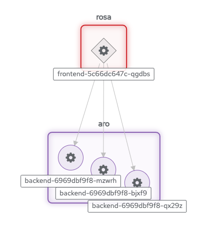

# Demo 2 - Connecting MultiClustering applications using Red Hat Interconnect

This demo locates the frontend and backend services in different namespaces, on different clusters.  Ordinarily, this means that they have no way to communicate unless they are exposed to the public internet.

Introducing Skupper into each namespace allows us to create a virtual application network that can connect services in different clusters. Any service exposed on the application network is represented as a local service in all of the linked namespaces.

The backend service is located in `ARO` cluster, but the frontend service in `ROSA` cluster can "see" it as if it were local.  When the frontend sends a request to the backend, Skupper forwards the request to the namespace where the backend is running and routes the response back to the frontend.

## 1. Overview

This example is a very simple multi-service HTTP application
deployed across Kubernetes clusters using Skupper.

It contains two services:

* A backend service that exposes an `/api/hello` endpoint.  It
  returns greetings of the form `Hi, <your-name>.  I am <my-name>
  (<pod-name>)`.

* A frontend service that sends greetings to the backend and
  fetches new greetings in response.

With Skupper, you can place the backend in one cluster and the
frontend in another and maintain connectivity between the two
services without exposing the backend to the public internet.

## 2. Prerequisites

### 2.1 Deploy ROSA Cluster

* Define the prerequisites for install the ROSA cluster

```sh
export VERSION=4.11.36 \
      ROSA_CLUSTER_NAME=poc-inter-1 \
      AWS_ACCOUNT_ID=`aws sts get-caller-identity --query Account --output text` \
      REGION=eu-west-1 \
      AWS_PAGER="" \
      CIDR="10.10.0.0/16"
```

* Create roles and cluster admin

```sh
rosa create account-roles --mode auto
rosa create cluster --cluster-name $ROSA_CLUSTER_NAME --sts --mode auto --yes
```

I: To determine when your cluster is Ready, run 'rosa describe cluster -c $ROSA_CLUSTER_NAME'.
I: To watch your cluster installation logs, run 'rosa logs install -c $ROSA_CLUSTER_NAME --watch'.

```md
rosa create admin -c $ROSA_CLUSTER_NAME
```

```
oc login https://api.poc-inter-1.xxx.com:6443 --username cluster-admin --password xxx
```

### 2.2 Deploy ARO cluster

* Define the prerequisites for install the ARO cluster

```sh
AZR_RESOURCE_LOCATION=eastus
AZR_RESOURCE_GROUP=poc-inter-2-rg
AZR_CLUSTER=poc-inter-2
AZR_PULL_SECRET=~/Downloads/pull-secret.txt
```

* Create an Azure resource group

```sh
 az group create \
   --name $AZR_RESOURCE_GROUP \
   --location $AZR_RESOURCE_LOCATION
```

* Create virtual network

```sh
 az network vnet create \
   --address-prefixes 10.0.0.0/22 \
   --name "$AZR_CLUSTER-aro-vnet-$AZR_RESOURCE_LOCATION" \
   --resource-group $AZR_RESOURCE_GROUP
```

* Create control plane subnet

```sh
 az network vnet subnet create \
   --resource-group $AZR_RESOURCE_GROUP \
   --vnet-name "$AZR_CLUSTER-aro-vnet-$AZR_RESOURCE_LOCATION" \
   --name "$AZR_CLUSTER-aro-control-subnet-$AZR_RESOURCE_LOCATION" \
   --address-prefixes 10.0.0.0/23 \
   --service-endpoints Microsoft.ContainerRegistry
```

* Create machine subnet

```sh
az network vnet subnet create \
  --resource-group $AZR_RESOURCE_GROUP \
  --vnet-name "$AZR_CLUSTER-aro-vnet-$AZR_RESOURCE_LOCATION" \
  --name "$AZR_CLUSTER-aro-machine-subnet-$AZR_RESOURCE_LOCATION" \
  --address-prefixes 10.0.2.0/23 \
  --service-endpoints Microsoft.ContainerRegistry
```

* Disable network policies on the control plane subnet

```sh
az network vnet subnet update \
  --name "$AZR_CLUSTER-aro-control-subnet-$AZR_RESOURCE_LOCATION" \
  --resource-group $AZR_RESOURCE_GROUP \
  --vnet-name "$AZR_CLUSTER-aro-vnet-$AZR_RESOURCE_LOCATION" \
  --disable-private-link-service-network-policies true
```

* Create the ARO cluster

```sh
 az aro create \
   --resource-group $AZR_RESOURCE_GROUP \
   --name $AZR_CLUSTER \
   --vnet "$AZR_CLUSTER-aro-vnet-$AZR_RESOURCE_LOCATION" \
   --master-subnet "$AZR_CLUSTER-aro-control-subnet-$AZR_RESOURCE_LOCATION" \
   --worker-subnet "$AZR_CLUSTER-aro-machine-subnet-$AZR_RESOURCE_LOCATION" \
   --pull-secret @$AZR_PULL_SECRET
```

* Get ARO OpenShift API Url

```sh
ARO_URL=$(az aro show -g $AZR_RESOURCE_GROUP -n $AZR_CLUSTER --query apiserverProfile.url -o tsv)
```

* Login into the ARO cluster and set context

```sh
ARO_KUBEPASS=$(az aro list-credentials --name $AZR_CLUSTER --resource-group $AZR_RESOURCE_GROUP -o tsv --query kubeadminPassword)
```

* Login into the ARO cluster and set context

```sh
oc login --username kubeadmin --password $ARO_KUBEPASS --server=$ARO_URL
```

## 3. Installing and Configuring Skupper CLI & Kubeconfigs

* Install the Skupper command-line tool

```sh
curl https://skupper.io/install.sh | sh
```

Skupper is designed for use with multiple namespaces, usually on
different clusters.  The `skupper` command uses your
[kubeconfig][kubeconfig] and current context to select the
namespace where it operates.

* Configure Kubeconfig for MultiClustering

```sh
rm -rf /var/tmp/interconnect-lab-kubeconfig
touch /var/tmp/interconnect-lab-kubeconfig
export KUBECONFIG=/var/tmp/interconnect-lab-kubeconfig

oc login https://api.poc-inter-1.xx.xxx.xxx.com:6443 --username cluster-admin --password xxx
kubectl config rename-context $(oc config current-context) $ROSA_CLUSTER_NAME
kubectl config use $ROSA_CLUSTER_NAME

oc login --username kubeadmin --password $ARO_KUBEPASS --server=$ARO_URL
kubectl config rename-context $(oc config current-context) $AZR_CLUSTER
kubectl config use $AZR_CLUSTER
```

## 4. Install and configure Red Hat Service Interconnect

_**ROSA Cluster**_

* Set context to ROSA cluster and create demo namespace:

```sh
kubectl config use $ROSA_CLUSTER_NAME
kubectl create namespace rosa
kubectl config set-context --current --namespace=rosa
```

* Install operator:

```sh
cat << EOF | kubectl apply -f -
apiVersion: operators.coreos.com/v1alpha1
kind: Subscription
metadata:
  name: skupper-operator
  namespace: openshift-operators
spec:
  channel: alpha
  installPlanApproval: Automatic
  name: skupper-operator
  source: redhat-operators
  sourceNamespace: openshift-marketplace
EOF
```

* Check installation

```sh
# Get Subscription
SUB=$(oc get subscription skupper-operator -n openshift-operators -o template --template '{{.status.currentCSV}}')

# Check status (wait until status is succeeded)
oc get csv $SUB -n openshift-operators -o template --template '{{.status.phase}}'
```

* Configure the skupper-site instance:

```sh
cat << EOF | kubectl apply -f -
apiVersion: v1
kind: ConfigMap
metadata:
  name: skupper-site
data:
  router-mode: interior
  console-user: "admin"
  console-password: "admin"
  console: "true"
  flow-collector: "true"
EOF
```

* Check skupper is configured:

```sh
skupper status
# Skupper is enabled for namespace "rosa" in interior mode. It is not connected to any other sites. It has no exposed services.
```

_**ARO Cluster**_

* Set context to ARO cluster and create demo namespace:

```sh
kubectl config use $AZR_CLUSTER
kubectl create namespace aro
kubectl config set-context $AZR_CLUSTER --namespace=aro
```

* Install operator:

```sh
cat << EOF | kubectl apply -f -
apiVersion: operators.coreos.com/v1alpha1
kind: Subscription
metadata:
  name: skupper-operator
  namespace: openshift-operators
spec:
  channel: alpha
  installPlanApproval: Automatic
  name: skupper-operator
  source: redhat-operators
  sourceNamespace: openshift-marketplace
EOF
```

* Check installation

```sh
# Get Subscription
SUB=$(oc get subscription skupper-operator -n openshift-operators -o template --template '{{.status.currentCSV}}')

# Check status (wait until status is succeeded)
oc get csv $SUB -n openshift-operators -o template --template '{{.status.phase}}'
```

* Configure the skupper-site instance:

```sh
cat << EOF | kubectl apply -f -
apiVersion: v1
kind: ConfigMap
metadata:
  name: skupper-site
EOF
```

* Check skupper is configured:

```sh
skupper status
# Skupper is enabled for namespace "aro" in interior mode. It is not connected to any other sites. It has no exposed services.
```

## 5. Link your namespaces

Creating a link requires use of two `skupper` commands in
conjunction, `skupper token create` and `skupper link create`.

The `skupper token create` command generates a secret token that
signifies permission to create a link.  The token also carries the
link details.  Then, in a remote namespace, The `skupper link
create` command uses the token to create a link to the namespace
that generated it.

**Note:** The link token is truly a *secret*.  Anyone who has the
token can link to your namespace.  Make sure that only those you
trust have access to it.

First, use `skupper token create` in one namespace to generate the
token.  Then, use `skupper link create` in the other to create a
link.

_**ROSA Cluster**_

```sh
kubectl config use $ROSA_CLUSTER_NAME --namespace=rosa
skupper token create /tmp/secret.token 
```

_**ARO Cluster**_

```sh
kubectl config use $AZR_CLUSTER --namespace=aro
skupper link create /tmp/secret.token
```

* In the same ARO cluster, check the skupper link status and see if the Link is with the connected status:

```sh
skupper link status
```

## 6. Deploy the frontend and backend services

Use `kubectl create deployment` to deploy the frontend service in `ROSA` and the backend service in `ARO`.

_**ROSA Cluster**_

* Deploy the frontend in the ROSA cluster:

```sh
kubectl config use $ROSA_CLUSTER_NAME --namespace=rosa
kubectl create --namespace rosa deployment frontend --image quay.io/rcarrata/skupper-summit-frontend:v4

# Wait until deployment is READY
kubectl get deploy frontend
```

_**ARO Cluster**_

* Deploy the backend in the ARO cluster:

```sh
kubectl config use $AZR_CLUSTER --namespace=aro
kubectl create --namespace aro deployment backend --image quay.io/rcarrata/skupper-summit-backend:v4 --replicas 3

# Wait until deployment is READY
kubectl get deploy backend
```

## 7. Expose the backend service

We have established connectivity between the two namespaces and made the backend in `ARO` available to the frontend in `ROSA`.

Before we can test the application, we need external access to the frontend.

_**ARO Cluster**_

```sh
skupper expose deployment/backend --port 8080
```

_**ROSA Cluster**_

```sh
kubectl config use $ROSA_CLUSTER_NAME --namespace=rosa
kubectl expose deployment/frontend --port 8080
oc expose svc/frontend
```

* TODO: convert the app into HTTPS (edge)

## 8. Test the application

Now we're ready to try it out.  Use `kubectl get route frontend` to look up the external IP of the frontend route.  Then use `curl` or a similar tool to request the `/api/health` endpoint at
that address.

_**ROSA Cluster**_

```sh
kubectl config use $ROSA_CLUSTER_NAME --namespace=rosa
FRONTEND_URL=$(kubectl get route frontend -o jsonpath='{.spec.host}')
curl http://$FRONTEND_URL/api/health
```

If everything is in order, you can now access the web interface by navigating to `http://$FRONTEND_URL` in your browser.

## 9. Accessing the web console

Skupper includes a web console you can use to view the application network.  To access it, use `skupper status` to look up the URL of the web console.  Then use `kubectl get secret/skupper-console-users` to look up the console admin password.

_**ROSA Cluster**_

```sh
skupper status
kubectl get route skupper -o jsonpath='{.spec.host}'
kubectl get secret/skupper-console-users -o jsonpath={.data.admin} | base64 -d
```

Navigate to the Skupper Console in your browser.  When prompted, log in as user `admin` and enter the password.

Inside 'Processes' tab you should see something like this:


